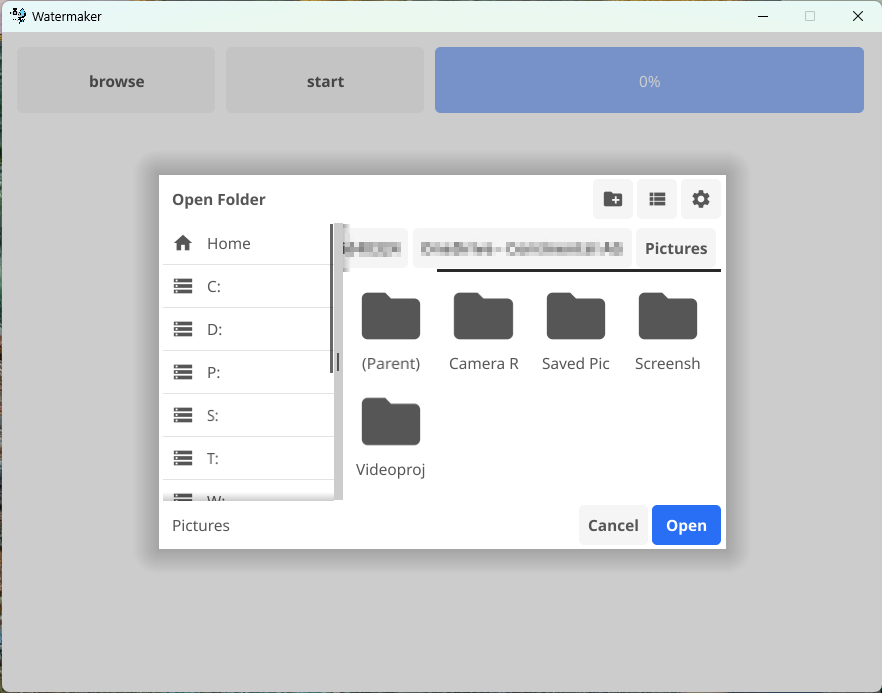
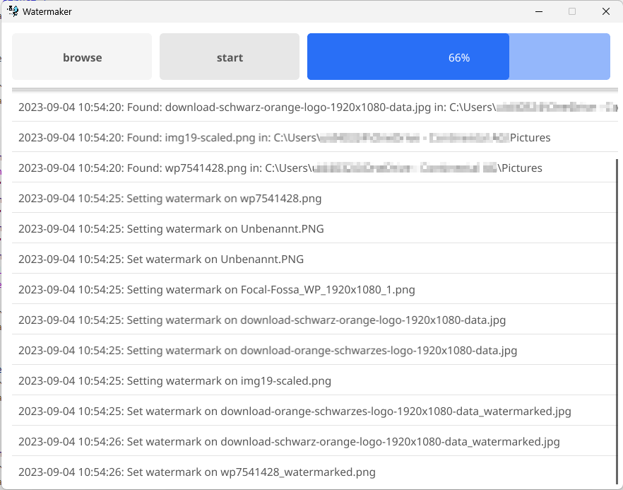

# water-maker

An app to watermark PNG, JPEG and GIF files. 

## Usage

The watermark file can be overwritten with the **WATERMARK_FILE** env variable.

## Build

Reruires **gcc** installed and **GCO_ENABLED** set to `1`.

```
git clone https://github.com/sarumaj/water-maker
cd water-maker
go build -ldflags="-s -w" ./cmd/water-mark/main.go -o /usr/local/bin/water-maker
```

## Screenshots



